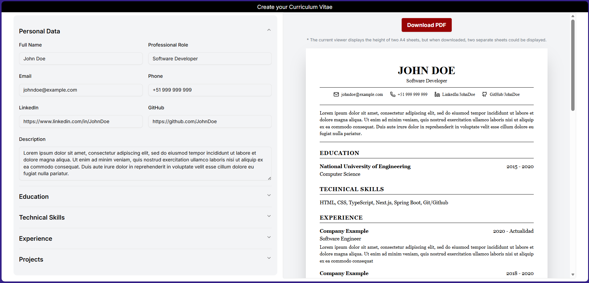

# CV Generator

A web application designed to efficiently create professional, Harvard-style curriculum vitae. Users can input personal details, education history, work experience, technical skills, and projects through a structured interface. The application offers a real-time preview of the document and generates a formatted PDF ready for download. (the web IS NOT ENABLED FOR MOBBILE PHONE SCREENS YET )

## Features

- **Real-time Preview**: updates the document view instantly as data is entered.
- **PDF Generation**: utilizes React-PDF to produce high-quality, printable documents.
- **Structured Data Entry**: provides organized fields for comprehensive profile management.
- **Professional Layout**: focuses on a clean, academic design standard.  
  
Example of what it looks like: 
  


## Installation

Clone the repository:

```bash
git clone https://github.com/JuanSilva2000/Curriculum-Vitae-Builder.git
```

Navigate to the project directory:

```bash
cd Curriculum-Vitae-Builder
```

Install dependencies:

```bash
npm install
```

Run the development web-app:

```bash
npm run dev
```

